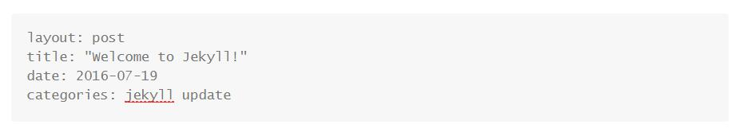
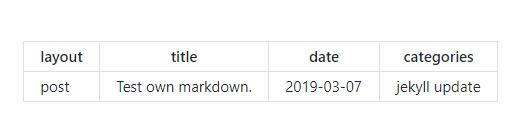

# 企业应用开发博客

#### 点击链接查看博客网页：[xinhao.space](https://zhang-yz.github.io/jekyll-project/)

------

#### 博客写作方法

博客使用markdown或者md文件，第一次先把远端仓库使用 `git clone` 命令复制到本地，在本地写好文件以后，先使用 `git pull --rebase origin master`	同步本地与远端的文件，然后点开 `_post` 文件夹，将写好的文件复制进去，使用 `git add` 、`git commit -m "your message"` 和 `git push origin master` 命令推至远端。半分钟后打开网址查看效果。

Ps：如果有操作失误请立刻联系其他组员。

------

#### 博客markdown文件格式

1.**文件名请使用 `YYYY-MM-DD-filename.md` 形式**，其中前面三节代表日期，后面是文件名称。（其中文件名称不是博文名称，日期也不是真正日期，格式正确就可以）

2.**markdown或md文件开头必须以以下格式开始**（**必须从第一行到第六行为以下六行**）：

```
---
layout: post
title: "Welcome to Jekyll!"
date: 2016-07-19
categories: jekyll update
---
```

其中 `title` 是博文的真正名字（可以和文件名字不同），`date` 是博文的真正日期，其他两项无需修改。

在 `Typora`上预览如下：



在 `github` 上预览如下：




------

## Jekyll template

Light and beautiful blog style template for jekyll

[](https://gitter.im/nikrich/jekyll-slender-template?utm_source=badge&utm_medium=badge&utm_campaign=pr-badge)
[](https://twitter.com/slender_rich)


## Demo
Find a demo [here](http://nikrich.github.io/jekyll-wing-template/#)

## Contributing

1. Clone the repo
2. Checkout the dev branch ( Do not work directly on master )
3. Use ```jekyll serve``` to run the project
4. Make your changes and test
5. Submit a pull request
